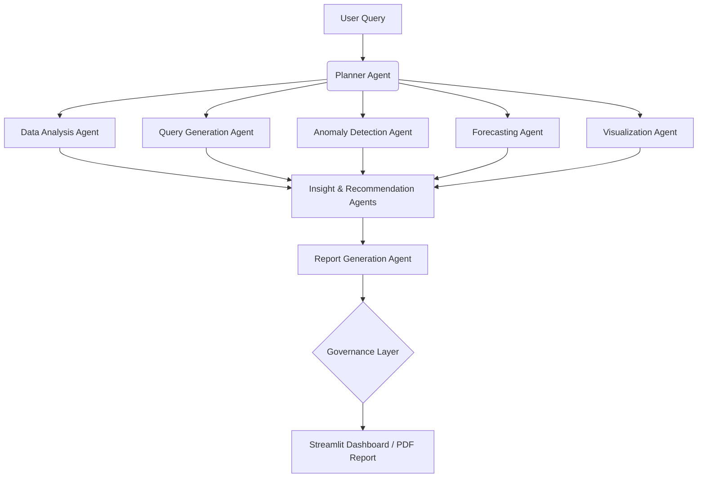

# Agentic Data Analyst: Autonomous Business Intelligence System

<div align="center">
  
  
  [](https://www.python.org/)
  [](https://fastapi.tiangolo.com/)
  [](https://streamlit.io/)
  [](https://python.langchain.com/v0.2/docs/langgraph/)
  [](https://www.docker.com/)
</div>

A multi-agent AI platform that converts natural-language business questions into SQL queries, anomaly-detection alerts, time-series forecasts, and executive-ready reports — built end-to-end with a focus on **governed, reproducible analytics pipelines** and **minimal human intervention**.

This project mirrors enterprise BI automation workflows: ingesting data, validating and transforming it under governance controls, running multi-layer analysis, and surfacing findings to non-technical stakeholders through automated dashboards and reports.

---

## 🎯 Key Features

- **Autonomous Agent Workflow:** A Planner Agent decomposes natural language queries into sub-tasks and routes them to specialized agents (Data Analysis, Query Generation, Visualization, etc.).
- **Proactive Anomaly Detection:** Utilizes IsolationForest, Z-score, and IQR to detect data outliers, risks, and quality issues before they escalate.
- **Advanced Forecasting:** Integrates Prophet and ARIMA models to predict time-series trends and demand.
- **RAG-Powered Knowledge Retrieval:** Embeds documents using HuggingFace and retrieves them via ChromaDB for context-aware business insights.
- **Executive Report Generation:** Automatically compiles analysis findings into polished PDF, HTML, and Markdown reports.
- **Interactive Dashboard:** A Streamlit-based frontend for exploring data, chatting with agents, and visualizing insights.

---

## 🏗️ Architecture & Workflow

The system is designed with a modular, production-grade architecture separating ingestion, transformation, analysis, and reporting.

### Agent Workflow
1. **User Query:** Submitted in natural language via the chat interface.
2. **Planner Agent:** Decomposes the question into specific sub-tasks.
3. **Specialized Agents:** Tasks are routed to specialists:
   - *Data Analysis Agent* (Pandas, NumPy, DuckDB)
   - *Query Generation Agent* (SQL/Pandas codegen via Mistral AI)
   - *Anomaly Detection Agent* (Scikit-learn, PyOD)
   - *Forecasting Agent* (Prophet, ARIMA)
   - *Visualization Agent* (Plotly)
   - *Insight & Recommendation Agents* (Business narrative & next steps)
   - *Report Generation Agent* (Compiles findings)
4. **Governance Layer:** Validates outputs and reconciliation checks.
5. **Output:** Displayed on the dashboard or exported as a report.



---

## 🛠️ Technology Stack

| Layer | Technologies |
|---|---|
| **Frontend** | Streamlit, Plotly |
| **Backend** | FastAPI, Uvicorn |
| **AI & Agent Framework** | Mistral AI, LangGraph, LangChain, HuggingFace |
| **Data Processing** | Pandas, NumPy, DuckDB, SciPy |
| **Vector Database (RAG)**| ChromaDB |
| **Database & Caching** | PostgreSQL, Redis |
| **Anomaly Detection** | Scikit-learn (IsolationForest), PyOD |
| **Forecasting** | Prophet, Statsmodels (ARIMA) |
| **Deployment** | Docker, Docker Compose |

---

## 📂 Project Structure

```text
Agentic_Bi/
├── agents/          # LangGraph agent definitions (planner, analysis, query, anomaly, forecast, report)
├── analytics/       # Core analytics logic (data_processor, anomaly_detector, forecasting, statistical_analysis)
├── backend/         # FastAPI service (routes, models, config, security)
├── frontend/        # Streamlit dashboard (pages, components, styles)
├── rag/             # RAG pipeline (loader, chunker, embedder, retriever)
├── memory/          # Redis-backed conversation memory
├── reports/         # PDF/HTML/Markdown report builders
├── vectorstore/     # ChromaDB integration
├── database/        # Schema, session management
├── deployment/      # Docker Compose, Dockerfiles, nginx
├── tests/           # Agent, analytics, and RAG test suites
├── requirements.txt # Python dependencies
└── .env.example     # Environment variables template
```

---

## ⚙️ Environment Variables

Copy `.env.example` to `.env` and configure the following variables. **Never commit your `.env` file or expose real API keys.**

| Variable | Description | Default / Required |
|---|---|---|
| `APP_ENV` | Application environment (development, production) | `development` |
| `DEBUG` | Enable debug mode in FastAPI/Streamlit | `True` |
| `MISTRAL_API_KEY` | Mistral API key for LLM agents | **Required** |
| `MISTRAL_MODEL` | Default Mistral model to use | `mistral-large-latest` |
| `MISTRAL_SMALL_MODEL` | Alternate smaller Mistral model for lightweight tasks | `mistral-small-latest` |
| `HUGGINGFACE_API_TOKEN` | Token for HuggingFace embeddings | *Optional* |
| `EMBEDDING_MODEL` | Model for embeddings | `sentence-transformers/all-MiniLM-L6-v2` |
| `DATABASE_URL` | PostgreSQL async connection string | **Required** |
| `DATABASE_SYNC_URL` | Optional sync DB URL | *Optional* |
| `REDIS_URL` | Redis instance URL | `redis://localhost:6379/0` |
| `VECTORSTORE_DIR` | Local path for ChromaDB storage | `./data/vectorstore` |
| `CHROMA_COLLECTION` | Collection name used by ChromaDB | `knowledge_base` |
| `API_HOST` | FastAPI host | `localhost` |
| `API_PORT` | FastAPI port | `8000` |
| `SECRET_KEY` | Secret key for JWT tokens | **Required** |
| `ALGORITHM` | JWT algorithm | `HS256` |
| `ACCESS_TOKEN_EXPIRE_MINUTES`| Token expiration in minutes | `1440` |
| `REQUIRE_AUTH` | Require auth for API routes | `False` |
| `UPLOAD_DIR` | Local directory for uploaded files | `./data/uploads` |
| `REPORTS_DIR`| Local directory for generated reports | `./data/reports` |

---

## 🚀 Installation & Setup

### 1. Clone the Repository
```bash
git clone https://github.com/Ganeshpawar74/Agentic-Data-Analyst-Autonomous-Business-Intelligence-System
cd agentic-data-analyst
```

### 2. Configure Environment Variables
```bash
cp .env.example .env
```
Edit the `.env` file and add your API keys and configuration strings.

### 3. Run with Docker (Recommended)
The easiest way to start the entire stack (Frontend, Backend, Postgres, Redis) is via Docker Compose.
```bash
cd deployment
docker-compose up --build
```

### 4. Run Locally (Without Docker)
Ensure you have PostgreSQL and Redis running locally.

**Create a Virtual Environment & Install Dependencies:**
```bash
python -m venv venv
source venv/bin/activate  # On Windows: venv\Scripts\activate
pip install -r requirements.txt
```

**Start the Backend:**
```bash
cd backend
uvicorn main:app --reload --port 8000
```

**Start the Frontend:**
Open a new terminal window:
```bash
cd frontend
streamlit run app.py
```

---

## 🌐 API Overview

The backend exposes a RESTful API powered by FastAPI.

| Method | Endpoint | Description |
|---|---|---|
| `POST` | `/upload` | Upload a single dataset (CSV / Excel / JSON) |
| `POST` | `/upload/multi` | Upload multiple datasets simultaneously |
| `GET`  | `/upload/datasets` | List all uploaded datasets |
| `POST` | `/analyze` | Run full agent analysis pipeline |
| `POST` | `/chat` | Conversational analytics interface |
| `POST` | `/generate-report` | Generate PDF/HTML executive report |
| `POST` | `/rag/upload` | Upload knowledge base documents |
| `POST` | `/rag/query` | Query the knowledge base |
| `GET`  | `/rag/status` | Get RAG collection status |
| `POST` | `/forecast` | Time-series forecasting (Prophet / ARIMA) |
| `GET`  | `/health` | API and service health check |

---

## 🚀 Future Work

- **Role-based access control** for multi-user and client-specific deployments
- **Configurable governance rules** per dataset — currently validation logic is hardcoded; making it declarative would generalize the system across industries
- **Query caching layer** for repeated questions to reduce LLM API costs on high-volume deployments
- **Scheduled pipeline runs** — trigger the full agent pipeline on a cron schedule so dashboards refresh automatically without any user prompt

---